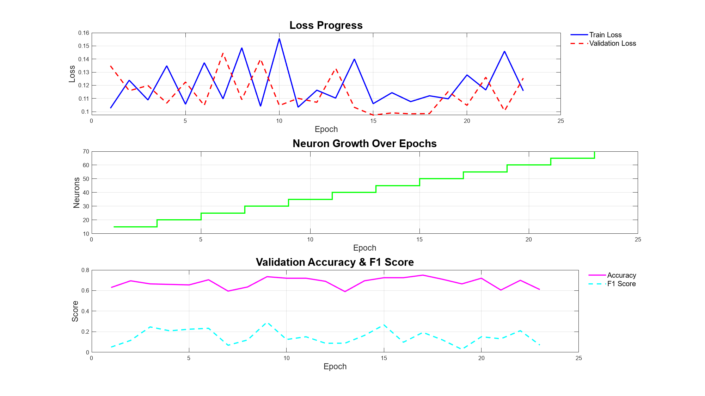
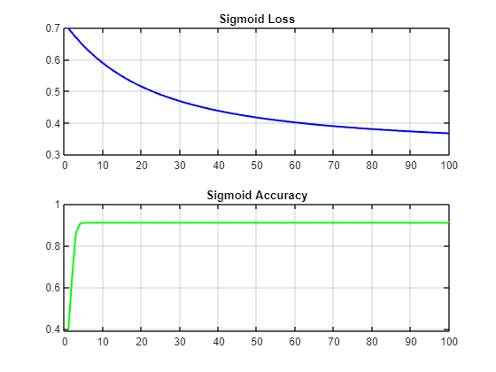
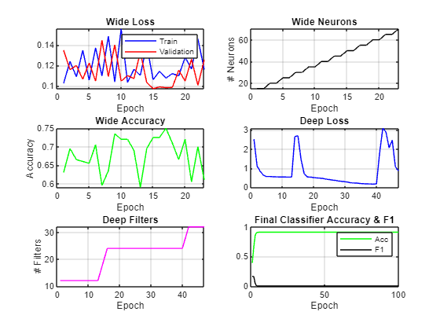
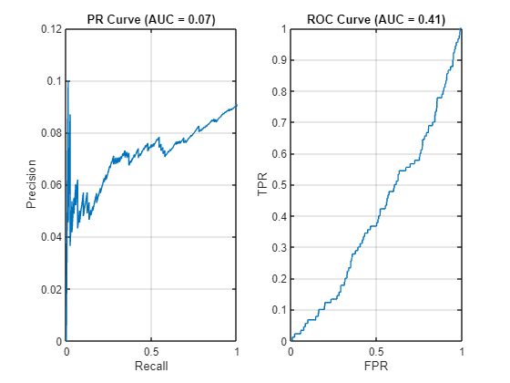

```matlab
addpath('G:\PhD\area of investigation\TASKS\the original chinees paper\Matlab_Code\shortcut_git\functions'); 

% === Step 1: Load or prepare your data ===
% sampledData must be a table where:
% - Column 1 = Customer ID (optional)
% - Column 2 = Label (0 or 1)
% - Columns 3 onward = Features

% Example: Load from a .mat file
sampledData = readtable('sampled_healthy_customers.csv', 'VariableNamingRule', 'preserve');

% === Step 2: Define training configuration (optional) ===
config = struct();
config.wideLR = 0.01;
config.wideNeurons = 15;
config.deepLR = 0.01;
config.deepFilters = 12;
config.patience = 8;
config.l2Lambda = 1e-4;

% === Step 3: Train the full model ===
model = trainWideAndDeepEndToEnd(sampledData, config);
```

```TextOutput
 Training Wide Component...
Epoch 001 | TrainLoss: 0.1026 | ValLoss: 0.1348 | Acc: 0.6300 | F1: 0.0513 | Neurons: 15 | LR: 0.01000
Epoch 002 | TrainLoss: 0.1239 | ValLoss: 0.1159 | Acc: 0.6950 | F1: 0.1159 | Neurons: 15 | LR: 0.01000
 Added neurons: 20 total neurons now
Epoch 003 | TrainLoss: 0.1089 | ValLoss: 0.1198 | Acc: 0.6650 | F1: 0.2472 | Neurons: 20 | LR: 0.01000
Epoch 004 | TrainLoss: 0.1348 | ValLoss: 0.1065 | Acc: 0.6600 | F1: 0.2093 | Neurons: 20 | LR: 0.01000
 Added neurons: 25 total neurons now
Epoch 005 | TrainLoss: 0.1057 | ValLoss: 0.1225 | Acc: 0.6550 | F1: 0.2247 | Neurons: 25 | LR: 0.01000
Epoch 006 | TrainLoss: 0.1372 | ValLoss: 0.1048 | Acc: 0.7050 | F1: 0.2338 | Neurons: 25 | LR: 0.01000
 Added neurons: 30 total neurons now
Epoch 007 | TrainLoss: 0.1098 | ValLoss: 0.1445 | Acc: 0.5950 | F1: 0.0690 | Neurons: 30 | LR: 0.01000
Epoch 008 | TrainLoss: 0.1486 | ValLoss: 0.1091 | Acc: 0.6350 | F1: 0.1205 | Neurons: 30 | LR: 0.01000
 Added neurons: 35 total neurons now
Epoch 009 | TrainLoss: 0.1040 | ValLoss: 0.1400 | Acc: 0.7350 | F1: 0.2933 | Neurons: 35 | LR: 0.01000
Epoch 010 | TrainLoss: 0.1557 | ValLoss: 0.1047 | Acc: 0.7200 | F1: 0.1250 | Neurons: 35 | LR: 0.01000
 Added neurons: 40 total neurons now
Epoch 011 | TrainLoss: 0.1034 | ValLoss: 0.1101 | Acc: 0.7200 | F1: 0.1515 | Neurons: 40 | LR: 0.00900
Epoch 012 | TrainLoss: 0.1163 | ValLoss: 0.1071 | Acc: 0.6900 | F1: 0.0882 | Neurons: 40 | LR: 0.00900
 Added neurons: 45 total neurons now
Epoch 013 | TrainLoss: 0.1103 | ValLoss: 0.1330 | Acc: 0.5900 | F1: 0.0889 | Neurons: 45 | LR: 0.00900
Epoch 014 | TrainLoss: 0.1400 | ValLoss: 0.1033 | Acc: 0.6950 | F1: 0.1644 | Neurons: 45 | LR: 0.00900
 Added neurons: 50 total neurons now
Epoch 015 | TrainLoss: 0.1061 | ValLoss: 0.0974 | Acc: 0.7250 | F1: 0.2667 | Neurons: 50 | LR: 0.00900
Epoch 016 | TrainLoss: 0.1144 | ValLoss: 0.0990 | Acc: 0.7250 | F1: 0.0984 | Neurons: 50 | LR: 0.00900
 Added neurons: 55 total neurons now
Epoch 017 | TrainLoss: 0.1076 | ValLoss: 0.0983 | Acc: 0.7500 | F1: 0.1935 | Neurons: 55 | LR: 0.00900
Epoch 018 | TrainLoss: 0.1121 | ValLoss: 0.0985 | Acc: 0.7100 | F1: 0.1212 | Neurons: 55 | LR: 0.00900
 Added neurons: 60 total neurons now
Epoch 019 | TrainLoss: 0.1098 | ValLoss: 0.1153 | Acc: 0.6650 | F1: 0.0290 | Neurons: 60 | LR: 0.00900
Epoch 020 | TrainLoss: 0.1279 | ValLoss: 0.1048 | Acc: 0.7200 | F1: 0.1515 | Neurons: 60 | LR: 0.00900
 Added neurons: 65 total neurons now
Epoch 021 | TrainLoss: 0.1165 | ValLoss: 0.1261 | Acc: 0.6050 | F1: 0.1319 | Neurons: 65 | LR: 0.00810
Epoch 022 | TrainLoss: 0.1460 | ValLoss: 0.1006 | Acc: 0.7000 | F1: 0.2105 | Neurons: 65 | LR: 0.00810
 Added neurons: 70 total neurons now
Epoch 023 | TrainLoss: 0.1158 | ValLoss: 0.1255 | Acc: 0.6100 | F1: 0.0714 | Neurons: 70 | LR: 0.00810
 Early stopping at epoch 23
✅ Training completed in 7.82 seconds.
```

<center></center>


```TextOutput
 Training Deep Component...
Epoch 01 - Loss: 2.5189 - Acc: 84.70% - Filters: 12
Epoch 02 - Loss: 1.1169 - Acc: 79.80% - Filters: 12
Epoch 03 - Loss: 0.8310 - Acc: 91.00% - Filters: 12
Epoch 04 - Loss: 0.6382 - Acc: 91.00% - Filters: 12
Epoch 05 - Loss: 0.5652 - Acc: 91.00% - Filters: 12
Epoch 06 - Loss: 0.5649 - Acc: 91.00% - Filters: 12
Epoch 07 - Loss: 0.5532 - Acc: 91.00% - Filters: 12
Epoch 08 - Loss: 0.5463 - Acc: 91.00% - Filters: 12
Epoch 09 - Loss: 0.5413 - Acc: 91.00% - Filters: 12
Epoch 10 - Loss: 0.5410 - Acc: 91.00% - Filters: 12
Epoch 11 - Loss: 0.5391 - Acc: 91.00% - Filters: 12
Epoch 12 - Loss: 0.5333 - Acc: 91.00% - Filters: 12
Epoch 13 - Loss: 0.5343 - Acc: 91.00% - Filters: 12
 Growing filters to 16
Epoch 14 - Loss: 2.6570 - Acc: 85.80% - Filters: 16
 Growing filters to 20
Epoch 15 - Loss: 2.6918 - Acc: 86.90% - Filters: 20
 Growing filters to 24
Epoch 16 - Loss: 1.4454 - Acc: 74.10% - Filters: 24
Epoch 17 - Loss: 0.7018 - Acc: 90.10% - Filters: 24
Epoch 18 - Loss: 0.5381 - Acc: 91.00% - Filters: 24
Epoch 19 - Loss: 0.5366 - Acc: 91.00% - Filters: 24
Epoch 20 - Loss: 0.5100 - Acc: 91.00% - Filters: 24
Epoch 21 - Loss: 0.4909 - Acc: 91.00% - Filters: 24
Epoch 22 - Loss: 0.4792 - Acc: 91.00% - Filters: 24
Epoch 23 - Loss: 0.4600 - Acc: 91.00% - Filters: 24
Epoch 24 - Loss: 0.4272 - Acc: 91.00% - Filters: 24
Epoch 25 - Loss: 0.4050 - Acc: 91.00% - Filters: 24
Epoch 26 - Loss: 0.3761 - Acc: 91.00% - Filters: 24
Epoch 27 - Loss: 0.3600 - Acc: 91.00% - Filters: 24
Epoch 28 - Loss: 0.3266 - Acc: 91.00% - Filters: 24
Epoch 29 - Loss: 0.3106 - Acc: 91.00% - Filters: 24
Epoch 30 - Loss: 0.2909 - Acc: 91.00% - Filters: 24
Epoch 31 - Loss: 0.2662 - Acc: 91.00% - Filters: 24
Epoch 32 - Loss: 0.2299 - Acc: 91.00% - Filters: 24
Epoch 33 - Loss: 0.2272 - Acc: 94.50% - Filters: 24
Epoch 34 - Loss: 0.2161 - Acc: 96.30% - Filters: 24
Epoch 35 - Loss: 0.1962 - Acc: 95.90% - Filters: 24
Epoch 36 - Loss: 0.1864 - Acc: 97.10% - Filters: 24
Epoch 37 - Loss: 0.1798 - Acc: 97.30% - Filters: 24
Epoch 38 - Loss: 0.1747 - Acc: 97.60% - Filters: 24
Epoch 39 - Loss: 0.1644 - Acc: 97.80% - Filters: 24
Epoch 40 - Loss: 0.1830 - Acc: 97.70% - Filters: 24
 Growing filters to 28
Epoch 41 - Loss: 1.8107 - Acc: 81.70% - Filters: 28
 Growing filters to 32
Epoch 42 - Loss: 3.0895 - Acc: 82.50% - Filters: 32
Epoch 43 - Loss: 2.8964 - Acc: 91.00% - Filters: 32
Epoch 44 - Loss: 2.0665 - Acc: 75.80% - Filters: 32
Epoch 45 - Loss: 2.4663 - Acc: 91.00% - Filters: 32
Epoch 46 - Loss: 1.0689 - Acc: 80.90% - Filters: 32
Epoch 47 - Loss: 0.8634 - Acc: 91.00% - Filters: 32
 Early stopping triggered at epoch 47
✅ Training finished in 120.27 seconds.
Epoch 01 - Loss: 0.6982 - Acc: 39.00% - F1: 0.1621
Epoch 02 - Loss: 0.6831 - Acc: 65.70% - F1: 0.1614
Epoch 03 - Loss: 0.6687 - Acc: 86.30% - F1: 0.0420
Epoch 04 - Loss: 0.6552 - Acc: 90.50% - F1: 0.0000
Epoch 05 - Loss: 0.6424 - Acc: 91.00% - F1: 0.0000
Epoch 06 - Loss: 0.6303 - Acc: 91.00% - F1: 0.0000
Epoch 07 - Loss: 0.6189 - Acc: 91.00% - F1: 0.0000
Epoch 08 - Loss: 0.6081 - Acc: 91.00% - F1: 0.0000
Epoch 09 - Loss: 0.5978 - Acc: 91.00% - F1: 0.0000
Epoch 10 - Loss: 0.5881 - Acc: 91.00% - F1: 0.0000
Epoch 11 - Loss: 0.5789 - Acc: 91.00% - F1: 0.0000
Epoch 12 - Loss: 0.5701 - Acc: 91.00% - F1: 0.0000
Epoch 13 - Loss: 0.5619 - Acc: 91.00% - F1: 0.0000
Epoch 14 - Loss: 0.5540 - Acc: 91.00% - F1: 0.0000
Epoch 15 - Loss: 0.5465 - Acc: 91.00% - F1: 0.0000
Epoch 16 - Loss: 0.5394 - Acc: 91.00% - F1: 0.0000
Epoch 17 - Loss: 0.5326 - Acc: 91.00% - F1: 0.0000
Epoch 18 - Loss: 0.5262 - Acc: 91.00% - F1: 0.0000
Epoch 19 - Loss: 0.5201 - Acc: 91.00% - F1: 0.0000
Epoch 20 - Loss: 0.5142 - Acc: 91.00% - F1: 0.0000
Epoch 21 - Loss: 0.5086 - Acc: 91.00% - F1: 0.0000
Epoch 22 - Loss: 0.5033 - Acc: 91.00% - F1: 0.0000
Epoch 23 - Loss: 0.4982 - Acc: 91.00% - F1: 0.0000
Epoch 24 - Loss: 0.4933 - Acc: 91.00% - F1: 0.0000
Epoch 25 - Loss: 0.4887 - Acc: 91.00% - F1: 0.0000
Epoch 26 - Loss: 0.4842 - Acc: 91.00% - F1: 0.0000
Epoch 27 - Loss: 0.4800 - Acc: 91.00% - F1: 0.0000
Epoch 28 - Loss: 0.4759 - Acc: 91.00% - F1: 0.0000
Epoch 29 - Loss: 0.4720 - Acc: 91.00% - F1: 0.0000
Epoch 30 - Loss: 0.4682 - Acc: 91.00% - F1: 0.0000
Epoch 31 - Loss: 0.4646 - Acc: 91.00% - F1: 0.0000
Epoch 32 - Loss: 0.4611 - Acc: 91.00% - F1: 0.0000
Epoch 33 - Loss: 0.4578 - Acc: 91.00% - F1: 0.0000
Epoch 34 - Loss: 0.4546 - Acc: 91.00% - F1: 0.0000
Epoch 35 - Loss: 0.4515 - Acc: 91.00% - F1: 0.0000
Epoch 36 - Loss: 0.4486 - Acc: 91.00% - F1: 0.0000
Epoch 37 - Loss: 0.4457 - Acc: 91.00% - F1: 0.0000
Epoch 38 - Loss: 0.4430 - Acc: 91.00% - F1: 0.0000
Epoch 39 - Loss: 0.4403 - Acc: 91.00% - F1: 0.0000
Epoch 40 - Loss: 0.4378 - Acc: 91.00% - F1: 0.0000
Epoch 41 - Loss: 0.4353 - Acc: 91.00% - F1: 0.0000
Epoch 42 - Loss: 0.4329 - Acc: 91.00% - F1: 0.0000
Epoch 43 - Loss: 0.4306 - Acc: 91.00% - F1: 0.0000
Epoch 44 - Loss: 0.4284 - Acc: 91.00% - F1: 0.0000
Epoch 45 - Loss: 0.4262 - Acc: 91.00% - F1: 0.0000
Epoch 46 - Loss: 0.4242 - Acc: 91.00% - F1: 0.0000
Epoch 47 - Loss: 0.4222 - Acc: 91.00% - F1: 0.0000
Epoch 48 - Loss: 0.4202 - Acc: 91.00% - F1: 0.0000
Epoch 49 - Loss: 0.4183 - Acc: 91.00% - F1: 0.0000
Epoch 50 - Loss: 0.4165 - Acc: 91.00% - F1: 0.0000
Epoch 51 - Loss: 0.4147 - Acc: 91.00% - F1: 0.0000
Epoch 52 - Loss: 0.4130 - Acc: 91.00% - F1: 0.0000
Epoch 53 - Loss: 0.4114 - Acc: 91.00% - F1: 0.0000
Epoch 54 - Loss: 0.4097 - Acc: 91.00% - F1: 0.0000
Epoch 55 - Loss: 0.4082 - Acc: 91.00% - F1: 0.0000
Epoch 56 - Loss: 0.4067 - Acc: 91.00% - F1: 0.0000
Epoch 57 - Loss: 0.4052 - Acc: 91.00% - F1: 0.0000
Epoch 58 - Loss: 0.4037 - Acc: 91.00% - F1: 0.0000
Epoch 59 - Loss: 0.4024 - Acc: 91.00% - F1: 0.0000
Epoch 60 - Loss: 0.4010 - Acc: 91.00% - F1: 0.0000
Epoch 61 - Loss: 0.3997 - Acc: 91.00% - F1: 0.0000
Epoch 62 - Loss: 0.3984 - Acc: 91.00% - F1: 0.0000
Epoch 63 - Loss: 0.3971 - Acc: 91.00% - F1: 0.0000
Epoch 64 - Loss: 0.3959 - Acc: 91.00% - F1: 0.0000
Epoch 65 - Loss: 0.3947 - Acc: 91.00% - F1: 0.0000
Epoch 66 - Loss: 0.3936 - Acc: 91.00% - F1: 0.0000
Epoch 67 - Loss: 0.3925 - Acc: 91.00% - F1: 0.0000
Epoch 68 - Loss: 0.3914 - Acc: 91.00% - F1: 0.0000
Epoch 69 - Loss: 0.3903 - Acc: 91.00% - F1: 0.0000
Epoch 70 - Loss: 0.3893 - Acc: 91.00% - F1: 0.0000
Epoch 71 - Loss: 0.3882 - Acc: 91.00% - F1: 0.0000
Epoch 72 - Loss: 0.3872 - Acc: 91.00% - F1: 0.0000
Epoch 73 - Loss: 0.3863 - Acc: 91.00% - F1: 0.0000
Epoch 74 - Loss: 0.3853 - Acc: 91.00% - F1: 0.0000
Epoch 75 - Loss: 0.3844 - Acc: 91.00% - F1: 0.0000
Epoch 76 - Loss: 0.3835 - Acc: 91.00% - F1: 0.0000
Epoch 77 - Loss: 0.3826 - Acc: 91.00% - F1: 0.0000
Epoch 78 - Loss: 0.3818 - Acc: 91.00% - F1: 0.0000
Epoch 79 - Loss: 0.3809 - Acc: 91.00% - F1: 0.0000
Epoch 80 - Loss: 0.3801 - Acc: 91.00% - F1: 0.0000
Epoch 81 - Loss: 0.3793 - Acc: 91.00% - F1: 0.0000
Epoch 82 - Loss: 0.3785 - Acc: 91.00% - F1: 0.0000
Epoch 83 - Loss: 0.3777 - Acc: 91.00% - F1: 0.0000
Epoch 84 - Loss: 0.3769 - Acc: 91.00% - F1: 0.0000
Epoch 85 - Loss: 0.3762 - Acc: 91.00% - F1: 0.0000
Epoch 86 - Loss: 0.3755 - Acc: 91.00% - F1: 0.0000
Epoch 87 - Loss: 0.3748 - Acc: 91.00% - F1: 0.0000
Epoch 88 - Loss: 0.3741 - Acc: 91.00% - F1: 0.0000
Epoch 89 - Loss: 0.3734 - Acc: 91.00% - F1: 0.0000
Epoch 90 - Loss: 0.3727 - Acc: 91.00% - F1: 0.0000
Epoch 91 - Loss: 0.3720 - Acc: 91.00% - F1: 0.0000
Epoch 92 - Loss: 0.3714 - Acc: 91.00% - F1: 0.0000
Epoch 93 - Loss: 0.3708 - Acc: 91.00% - F1: 0.0000
Epoch 94 - Loss: 0.3701 - Acc: 91.00% - F1: 0.0000
Epoch 95 - Loss: 0.3695 - Acc: 91.00% - F1: 0.0000
Epoch 96 - Loss: 0.3689 - Acc: 91.00% - F1: 0.0000
Epoch 97 - Loss: 0.3683 - Acc: 91.00% - F1: 0.0000
Epoch 98 - Loss: 0.3678 - Acc: 91.00% - F1: 0.0000
Epoch 99 - Loss: 0.3672 - Acc: 91.00% - F1: 0.0000
Epoch 100 - Loss: 0.3666 - Acc: 91.00% - F1: 0.0000
```

<center></center>


<center></center>


<center></center>

